# README for rsync-assignment
Created by: Sora Schlegel and Sethavan Sen

## Table of Contents

- [Creating Server One](#creating-server-one)
  - [DigitalOcean Droplet Setup Server One](#digitalocean-droplet-setup-server-one)
  - [Creating a User Server One](#creating-a-user-server-one)
  - [Remove Root User Access Server One](#remove-root-user-access-server-one)
- [Creating Backup Server](#creating-backup-server)
  - [DigitalOcean Droplet Setup Backup Server](#digitalocean-droplet-setup-backup-server)
  - [Creating a User Backup Server](#creating-a-user-backup-server)
  - [Remove Root User Access Backup Server](#remove-root-user-access-backup-server)
  - [Accessing Backup Server From Server One](#accessing-backup-server-from-server-one)
- [Backup Script](#backup-script)
  - [Creating the Backup Script Configuration File](#creating-the-backup-script-configuration-file)
  - [Creating the Backup Script](#creating-the-backup-script)
- [Service File](#service-file)
- [Service File Timer](#service-file-timer)

## Creating Server One

### DigitalOcean Droplet Setup Server One

1. Create a SSH key on your local machine using the command `ssh-keygen -t ed25519 "you-email@gmail.com"`.

- Note: Press the "Enter" key when prompted for a passphrase.

2. Save and name the SSH in your `.ssh` directory in your home directory.

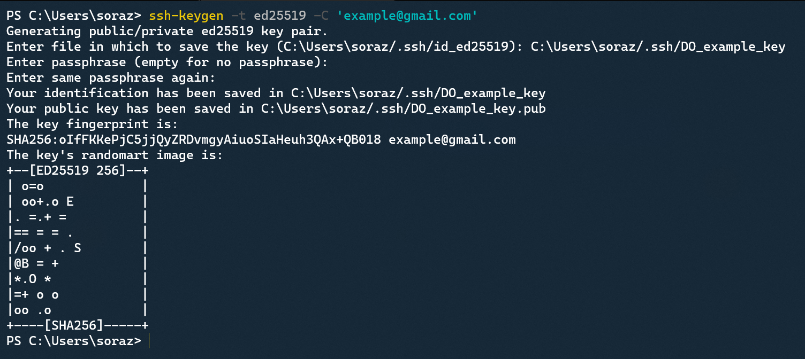

- **Note:** When a key is created, two files are created. We will only be using the file with the `.pub` extension. **DO NOT** use the file without the `.pub` extension.

3. Use the following command to display the SSH key and copy the code.

	`cat ~/.ssh/DO_example_key.pub`

4. Add the SSH key on your DigitalOcean account under Settings -> Security -> Add SSH key.

- Note: Remember the name entered for the SSH created. 

5. Create a droplet on DigitalOcean and select the name of the SSH created in the previous step under Choose Authentication Method, and set the Hostname to "server-one".

6. Once the droplet is created, copy the IP address and you should be able to access the remote server using the following command in your local terminal:

	`ssh -i ~/.ssh/DO_example_key root@165.232.151.30`

- Note: Type "yes" when prompted "Are you sure you want to continue connecting (yes/no/[fingerprint])?"

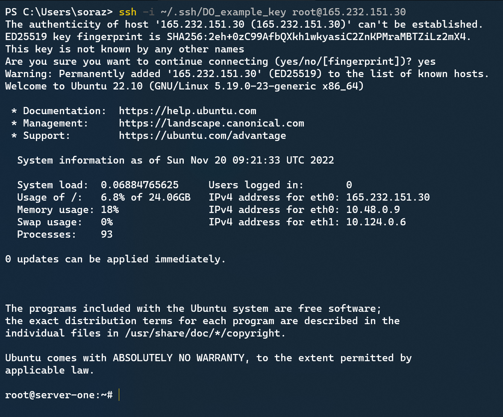

### Creating a User Server One

1. Use the following commands to create a user, since it is not a good practice to be logging into the root user all the time.

	`useradd -ms /bin/bash user1`

	`passwd user1`

	`usermod -aG sudo user1`

	`rsync --archive --chown=user1:user1 ~/.ssh /home/user1`

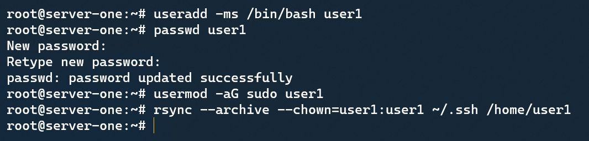

2. Verify that the user created exists in the `/home` directory and that there is a `.ssh` directory in the users home directory.

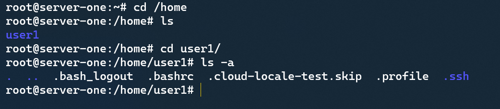

3. You should now be able to log in to the user using the following command from your local terminal.

	`ssh -i ~/.ssh/DO_example_key user1@165.232.151.30`

### Remove Root User Access Server One

1. Log in as user created in step 7 from your local terminal.

2. Use the command `sudo vim /etc/ssh/sshd_config`.

3. Change the "PermitRootLogin yes" to "PermitRootLogin no" then save the file.

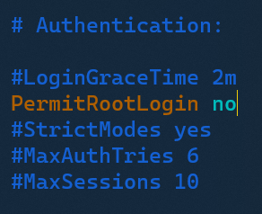

4. Use the command `sudo systemctl restart ssh`.

5. Verify that you are unable to access the root user in Server One.

- Note: Although this is not required for the lab, it is a good practice to disable the ability to access the root user via SSH.

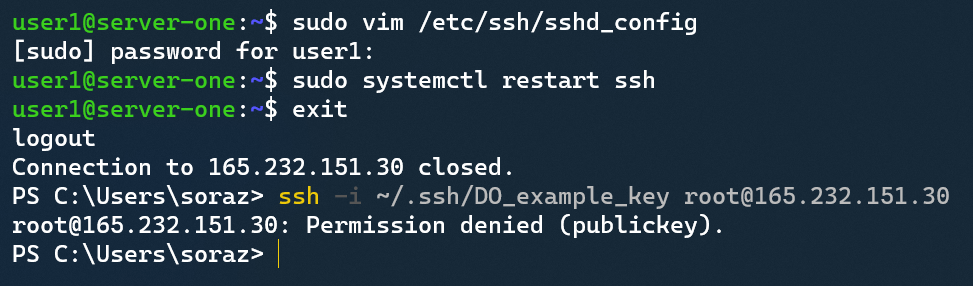

You have successfully created Server One.

---

## Creating Backup Server

### DigitalOcean Droplet Setup Backup Server

1. Follow the same steps as [DigitalOcean Droplet Setup Server One](#digitalocean-droplet-setup-server-one) when creating a droplet for the Backup Server on DigitalOcean.

- Note: You can create a new SSH key or use the same one as Server One.

### Creating a User Backup Server

1. Follow the same steps as [Creating a User Server One](#creating-a-user-server-one) to create a new user.

- Note: The name of the user should not be the same as Server One. 

### Remove Root User Access Backup Server

1. Follow the same steps as [Remove Root User Access Server One](#remove-root-user-access-server-one) to remove the ability to access the root user via SSH.

### Accessing Backup Server From Server One

2. Create a new SSH key on server-one with the new user you had created.

- Note: DO NOT use the same file name as the SSH key for server-one.

3. From you local machine, use the following command to copy the generated SSH in server-one to your local machine.

- Note: You should be in the `.ssh` directory of your local machine before doing the following commands.

	` sftp -i ~/.ssh/DO_example_key user1@165.232.151.30`

	`cd .ssh`

	`get server_one_key.pub`

	`exit`

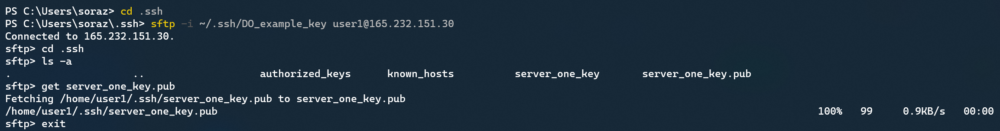

4. From your local machine, use the following command to copy the copied SSH key file from server-one to backup-server.

	` sftp -i ~/.ssh/DO_example_key backup-user1@143.198.153.178`

	`cd .ssh`

	`put server_one_key.pub`

	`exit`

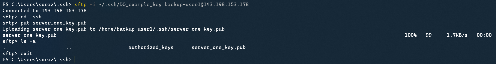

If successful, the SSH key file genereated on server-one is now in the `.ssh` directory in the user created on the backup-server.

5. Add the contents of the SSH key file to the `authorized_keys` file on your backup-server by using the command below:

	`cat server_one_key.pub >> authorized_keys`

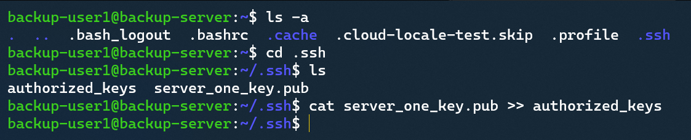

If successful, you will be able to access backup-server from server-one.

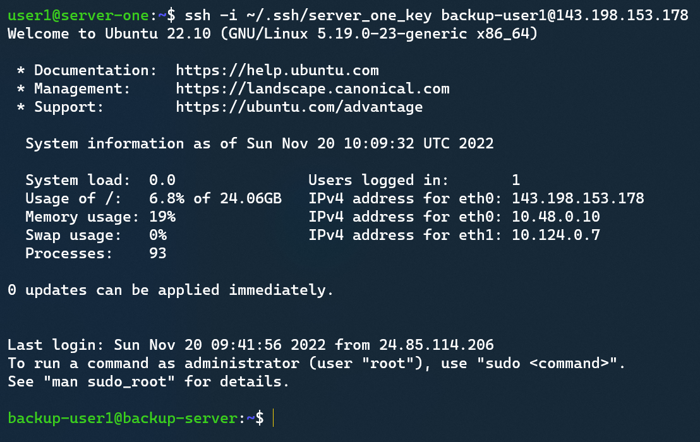

You have now successfully created the Backup Server that is accessible from both the local terminal and from Server One.

---

## Backup Script

### Creating the Backup Script Configuration File

1. Create a directory in the `/etc` directory to save the configuration file by using the commands below:

- **Note:** This file must be placed in the `/etc` folder.

	`cd /etc`

	`sudo mkdir backup-dir-conf`

1. Create a config file for the script to read in the directory created in step 1 by typing in the command.

	`cd /backup-dir-conf`

	`sudo touch backup-dir-script.conf`

2. To verify that the file exists, type in the following command:

	`ls | grep "backup-dir-script.conf"`


3. Make the file writable so changes can be made. Type in the following command:

	`sudo chmod 646 backup-dir-script.conf`

4. Verify that the file has the `w` option by typing in the following command:

	`ls -l | grep "backup-dir-script.conf"`


5. Use the `vim` tool add the following contents:

	```
	DIRECTORIES=("$HOME/folder1" "$HOME/folder2")
	
	DESTINATION="/home/backup-sora/backups"

	BACKUP_HOST_NAME="backup-sora"

	IP_ADDRESS="159.223.207.71"

	SSH_FILE="$HOME/.ssh/DO_server_one_key"
	```

- **Important Note:** The information to enter will not be the same. You will enter the information based on the second server, which is the backup server.

- **Note:** the directory, `folder1` and `folder2` must exist in your home directory, or select any directory you would like to backup.

The configuration file has been created successfully.

---

### Creating the Backup Script

1. Create an executable script by typing in the following code:

- **Note:** Create this file in a new directory in your home directory

	`cd ~`

	`mkdir wk11`

	`cd wk11`

	`touch backup-dir`

	`sudo chmod +x backup-dir`

- To verify that the file is an executable, type in the following command. The file should now have the `x` option just like the image below.

	`ls -l`


3. Using the `vim` tool, add the following contents:

	```
	#!/bin/bash


	source /etc/backup-dir-conf/backup-dir-script.conf

	rsync -aPv -e "ssh -i $SSH_FILE" ${DIRECTORIES[@]} $BACKUP_HOST_NAME@$IP_ADDRESS:$DESTINATION
	```

4. After running the script, the copied directories will now be saved in the backup server in the `backups` folder in the home directory.

Server-one `/home/sora` directory

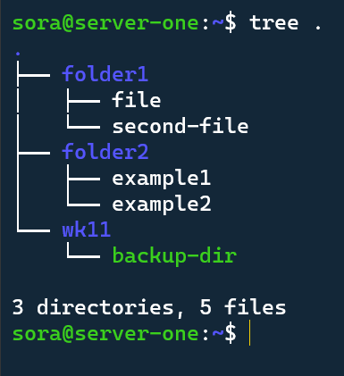

Backup-server `/home/backup-sora` directory

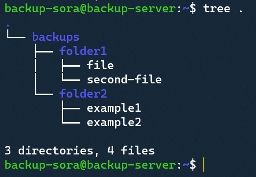

- **Note:** I used the `tree` command which is not preinstalled. For more information, visit this **[tree command](https://www.cyberciti.biz/faq/linux-show-directory-structure-command-line/#:~:text=You%20need%20to%20use%20command,given%20directories%20each%20in%20turn.)** link.

You have now successfully created a script to run the rsync command.

---

## Service File

1. Create a new directory in `/opt` and copy the backup script to the new directory by using the commands:

	`sudo mkdir backdir`

	`sudo cp -pv ~/wk11/backup-dir /opt/backdir`

- **Note:** The copied backup-dir file must remain as an executable file.

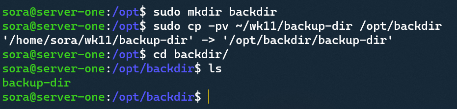

2. Create the service file in the `/etc/systemd/system` directory by using the following commands:

	`sudo touch backup-dir.service`

	`sudo chmod 646 backup-dir.service`

3. Using the `vim` tool, add the following contents into the `backup-dir.service` that was created in the previous step.

	```
	[Unit]
	Description=Creates a backup directory for the list of directories specified in the configuration file
	
	[Service]
	ExecStart=/opt/backdir/backup-dir
	User=sora

	[Install]
	WantedBy=multi-user.target
	```

4. Enable the new service by using the following commands:

	`sudo systemctl daemon-reload`
	
	`sudo systemctl enable --now backup-dir.service`

	`sudo systemctl start backup-dir.service`

5. To check if the service was successful use the command:	

	`sudo systemctl status backup-dir.service`

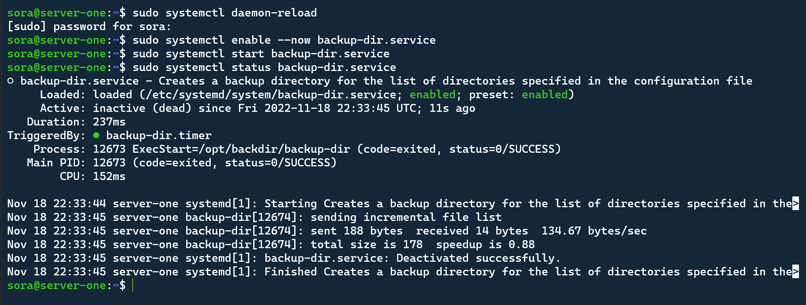

6. Check if the directories exist in the backup-server by using the `tree` command in your home directory. The screenshot below shows the `backups` directory being created after running the command `sudo systemctl start backup-dir.service`.

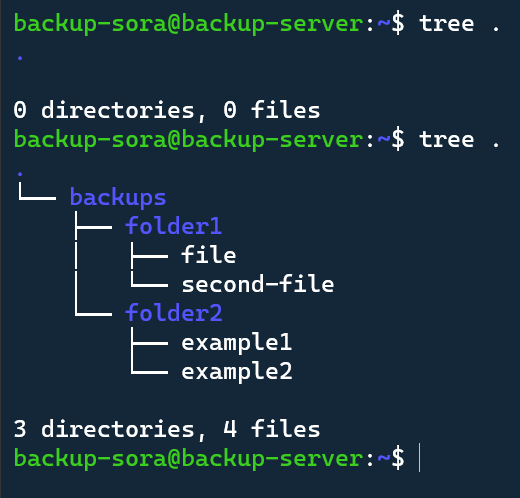

**Trouble Shooting Steps:**

- If you are getting the error message `Host Key Verification Failed`, edit the `/opt/backdir/backup-dir` and use the following command instead of the original rsync command:

	`rsync -aPv -e "ssh -o StrictHostKeyChecking=no -i $SSH_FILE" ${DIRECTORIES[@]} $BACKUP_HOST_NAME@$IP_ADDRESS:$DESTINATION`

- If you are getting the error message `rsync Permission Denied (publickey)`, then either:

  1. You are using the wrong ssh keypair file to connect

  2. You did not set up the ssh keypair correctly

- For more information on the `rsync` command, you can refer to the man page by typing in the command `man rsync`.

You have now successfully created a service file to run the backup-dir script.

---

## Service File Timer

- **Note:** Before proceeding, the timezone by default is set to UTC. To change to change it to PST, use the command `sudo timedatectl set-timezone America/Vancouver`.

- Note: Check the current timezone by using `timedatectl` command.

1. Create a timer service file in the `/etc/systemd/system` directory by using the following commands:

	`sudo touch backup-dir.timer`

	`sudo chmod 646 backup-dir.timer`

2. Use the `vim` utility to add the following contents into the `backup-dir.timer` file.

	```
	[Unit]
	Description=Runs the backup-dir script every Friday around 01:00

	[Timer]
	OnCalendar=Fri *-*-* 01:00:00
	RandomizedDelaySec=25m
	Persistent=true
	Unit=backup-dir.service
	
	[Install]
	WantedBy=timers.target
	```

- **Note:** If you would like to change the time when the script is run, learn more about the **[OnCalendar option](https://wiki.archlinux.org/title/Systemd/Timers)** link. 

3. To enable to the created `backup-dir.timer`, use the following commands:

	`sudo systemctl daemon-reload`

	`sudo systemctl enable --now backup-dir.timer`

4. To check the status of the timer use the command:

	`sudo systemctl status backup-dir.timer`

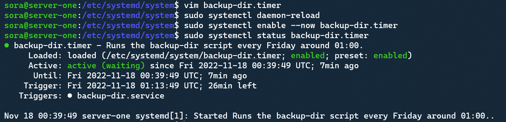

You have now successfully created a service timer to specify when to run the `backup-dir.service` file

